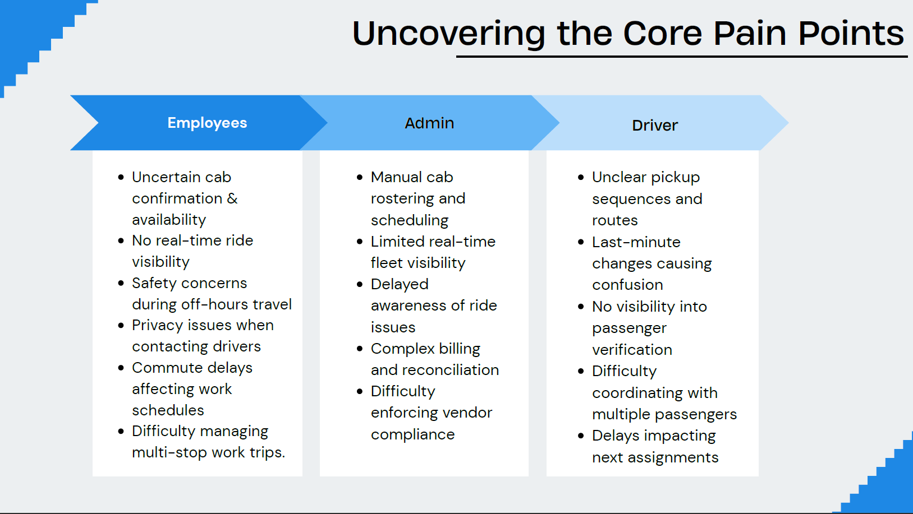
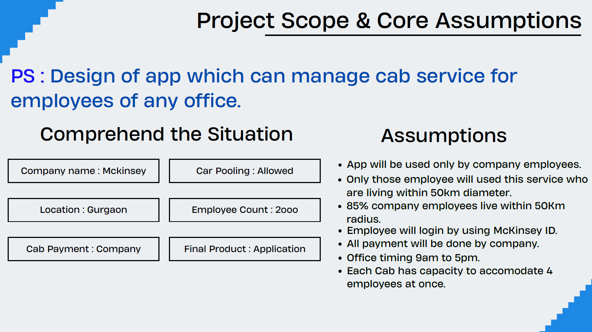
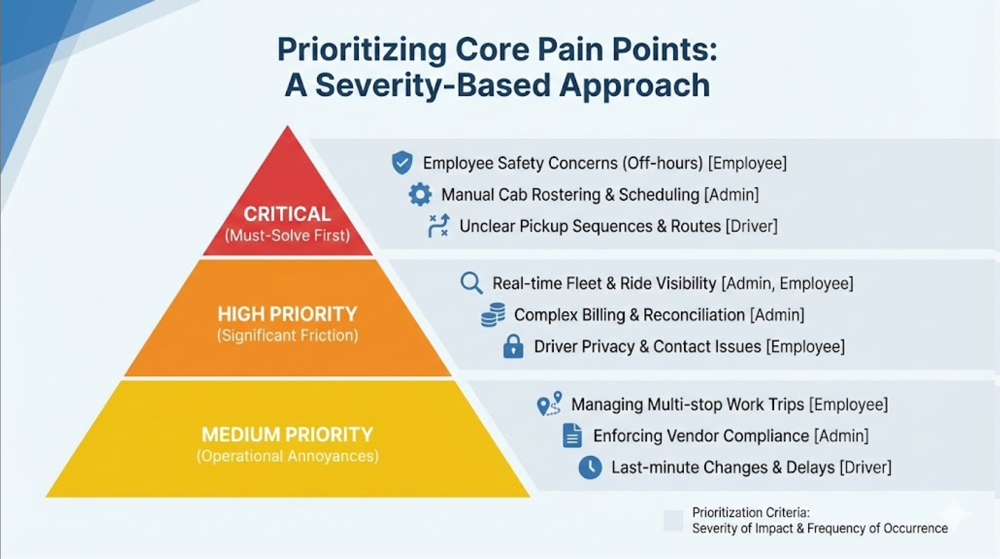

## 📌 Problem Context

## 🔍 User Pain Points

## ⚖️ Feature Prioritization

# McKinGo – Employee Cab Management System

> Designed a multi-stakeholder cab management system by prioritizing safety, visibility, and operational efficiency across employees, drivers, and admins.

---

## 🚨 Problem
Corporate cab systems lack real-time visibility, efficient scheduling, and safety mechanisms, leading to poor employee experience and operational inefficiencies for admins and drivers.

---

## 🔍 Key Insights
- ~700–750 employees require daily cab services  
- No real-time ride tracking or visibility  
- Safety concerns during off-hours travel  
- Manual scheduling leads to inefficiencies  
- Multiple stakeholders (employees, drivers, admins) with conflicting needs  

---

## 💡 Solution
Designed an end-to-end cab management system with:
- Live ride tracking  
- Automated cab rostering  
- SOS safety feature  
- Passenger verification  
- Vendor auto-payment system  

---

## ⚙️ Approach
- Segmented users into employees, drivers, and admins  
- Mapped end-to-end user journeys across stakeholders    
- Prioritized features using **severity-based prioritization**  
- Applied **RICE framework** for feature evaluation  
- Built roadmap using **MoSCoW prioritization**  

---

## 📈 Impact
- Improved fleet utilization and cab allocation efficiency  
- Enhanced safety and real-time visibility for employees  
- Reduced manual coordination overhead for admin teams    

---

## 🧠 Product Thinking
Focused on solving **high-severity problems first (safety + visibility)** before optimizing for advanced features.

Key trade-off:
- Prioritized reliability and safety over complex optimizations (e.g., AI routing)  
- Ensured system scalability across different user groups  

---

## 📎 Case Study
[View Full Deck](./mckingo-case-study.pdf)
